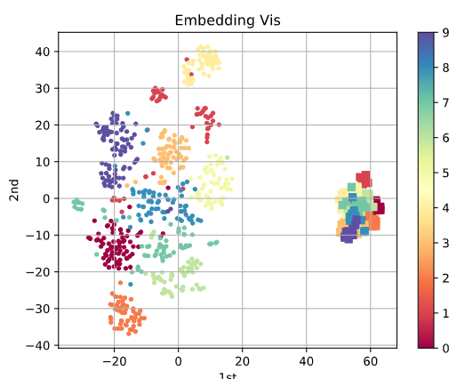
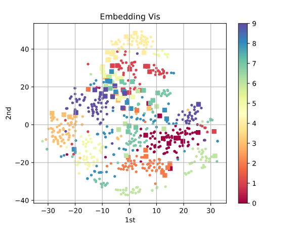
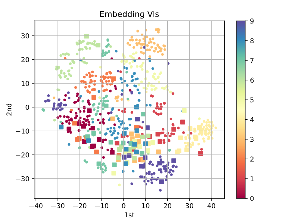
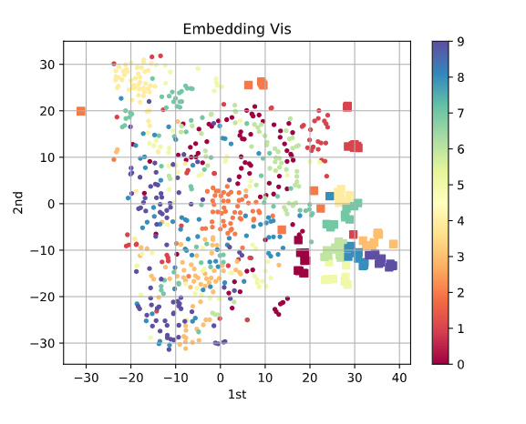
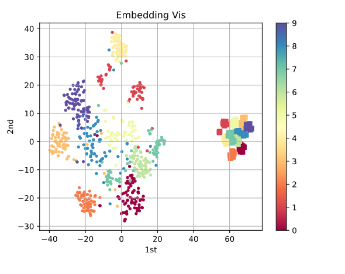
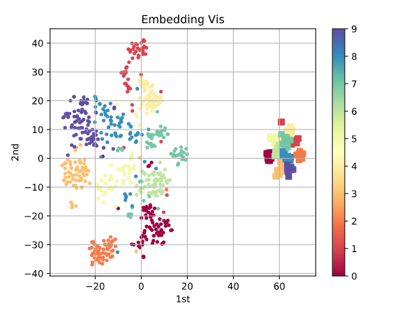
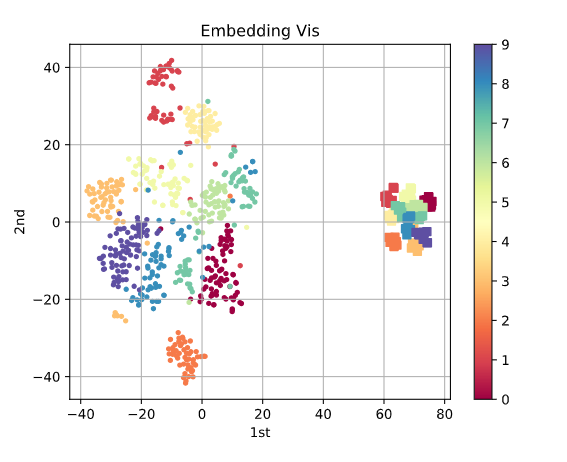
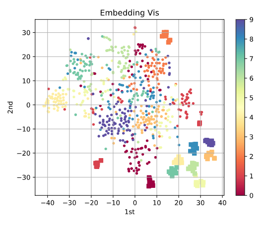
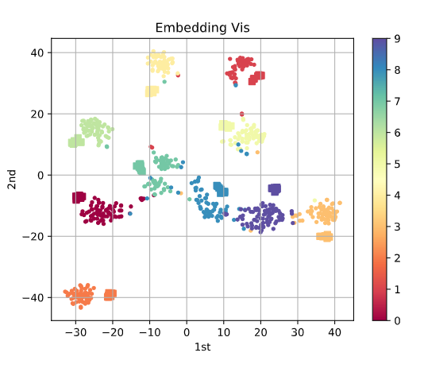
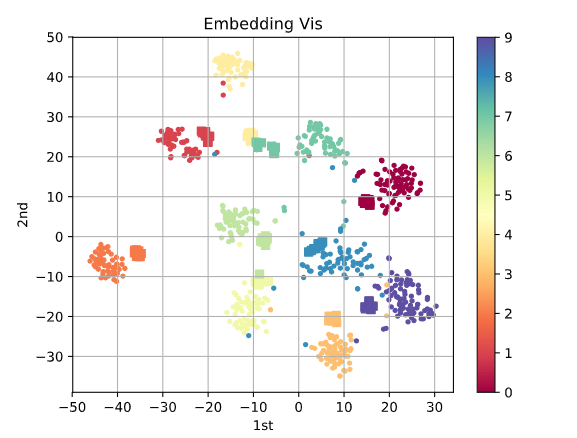

# SketchyDatabase

[](LICENSE)    

This project is a repo of [**The Sketchy Database: Learning to Retrieve Badly Drawn Bunnies**](https://www.cc.gatech.edu/~hays/tmp/sketchy-database.pdf).

The [**homepage**](http://sketchy.eye.gatech.edu/) of the original project.

# DataSet

Sketchy Database

### Test Set

As I didn't notice that the Sketchy Database contained a list of the testing photos, I randomly chose the testing photos and their related sketches myself. The test data set are listed in [TEST_IMG](test_img.txt) and [TEST_SKETCH](test_sketch.txt)

|   category  | photo | sketch |
|    :---:    | :---: | :---:  |
|   airplane  |   10  |   75   |
| alarm_clock |       |   52   |
|     ant     |       |   53   |
|     .       |       |   .    |
|     .       |       |   .    |
|     .       |       |   .    |
|     window  |       |   54   |
| wine_bottle |       |   52   |
|     zebra   |       |   66   |
|  **Total**  |  1250 |  7875  |

### The Dataset Structure in My Project

```Bash
Dataset
  ├── photo-train               # the training set of photos
  ├── sketch-triplet-train      # the training set of sketches
  ├── photo-test                # the testing set of photos
  ├── sketch-triplet-test       # the testing set of sketches
```
# Test

using [feature_extract.py](https://github.com/CDOTAD/SketchyDatabase/blob/master/feature/feature_extract.py) to get the extracted feature files ('\*.pkl')

using [retrieval_test.py](https://github.com/CDOTAD/SketchyDatabase/blob/master/retrieval_test.py) to get the testing result.

# Testing Result

There is no GoogLeNet, which resulted the best in the original paper, implement in PyTorch, so I used vgg16 instead.

|                        model                             | epoch | recall@1 | recall@5|
|                        :---:                             | :---: | :---:    | :---:   |
| resnet34(pretrained;mixed training set;metric='cosine')  |        | |                 |
|                                                          |  90   |  8.51%   |  18.68% |
|                                                          |  150  |  9.31%   |  20.44% |
|resnet34(pretrained;mixed training set;metric='euclidean')|       | |                  |
|                                                          |  90   |  6.45%   |  14.79% |
|                                                          |  150  |  6.96%   |  16.46% |
|resnet34(150 epoch;triplet loss m=0.02;metric='euclidean';lr=1e-5 batch_size=16)| | |  |
|                                                          |  85   |  9.87%   |  22.37% |
|vgg16(pretrained;triplet loss m=0.3;metric='euclidean';lr=1e-5;batch_size=16)    | | | |
|                                                          |   0   |  0.17%   |  0.72%  |
|                                                          |   5   |  17.59%  |  45.51% |
|                                                          |  190  |  31.03%  |  67.86% |
|                                                          |  275  |  32.22%  |  68.48% |
|                                                          |  975  |  35.24%  |  71.53% |
|vgg16(fine-tune(275epoch);m=0.15;metric='euclidean';lr=1e-7;batch_size=16)   | | |     |
|                                                          |  55   |  33.22%  |  70.04% |
|                                                          | 625   |  35.78%  |  72.44% |
|                                                          | 995   |  36.09%  |  73.02% |
|resnet50(pretrained; triplet loss m=0.15; metric='euclidean'; lr=1e-7;batch_size=16)||||
|                                                          |   0   |  0.71%   |  11.48% |
|                                                          |   55  |  10.18%  |  29.94% |
|                                                          |  940  |  15.17%  |  47.61% |
|resnet50(pretrained; triplet loss m=0.1; metric='euclidean'; lr=1e-6 batch_size=32)||| |
|                                                          |  315  |  19.58%  |  57.19% |
|resnet50(pretrained; triplet loss m=0.3; metric='euclidean'; lr=1e-5 batch_size=48)||| |
|                                                          |  20   |  21.56%  |  57.50% |
|                                                          |  95   |  30.32%  |  71.73% |
|        <span id="resnet"></span>                         |  265  |  40.08%  |  78.83% |
|                                                          |  930  |  46.04%  |  83.30% |

I have no idea about why the resnet34 got that bad result, while the vgg16 and resnet50 resulted pretty well.

### Retrieval Result

I randomly chose 20 sketches as the query sketch and here is the retrieval result. The model I used is the [resnet50](#resnet)(pretrained; triplet loss m=0.3; metric='euclidean'; lr=1e-5 batch_size=48) after 265 training epoch.


# Feature Visulization via T-SNE

all the visulizated categories are the first ten categories in alphabetical order.

**The boxes represent the photos, while the points represent the sketches.**

|                    model                  |                     vis                   |
|                    :---:                  |                    :---:                  |
|       resnet34 pretrained on ImageNet     ||
|    **pretrained; sketch branch& photo branch are trained sparately**           |
|         resnet34                          || 
|    **pretrained; mixed training set**                                                 |
|      resnet34 after 90 training epoch     |      |
|      resnet34 after 150 training epoch    |     |
|    **pretrained; triplet loss m=0.3 lr=1e-5**                                         |
|    vgg16 after 0 training epoch           | |
|    vgg16 after 5 training epoch           |   |
|    vgg16 after 190 training epoch         | |
|   **fine tune; triplet loss m=0.15 lr=1e-7**                                          |
| vgg16(fine tune) after 995 training epoch | |
|    **pretrained; triplet loss m=0.15 lr=1e-7**                                        |
|      resnet50 after 0 training epoch      |     |
|      resnet50 after 940 training epoch    |   |
|   **pretrained; triplet loss m=0.1 lr=1e-6**                                          |
|      resnet50 after 315 training epoch    |   |
|   **pretrained; triplet loss m=0.3 lr=1e-5 batch_size=48**                            |
|     resnet50 after 265 training epoch     ||
